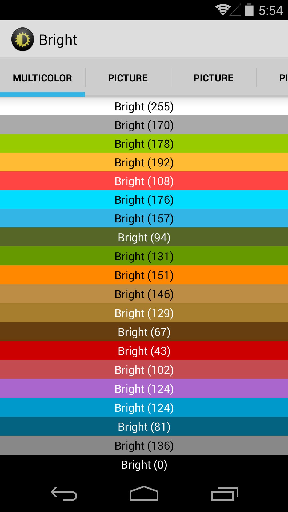

[](https://android-arsenal.com/details/1/92)
[](https://jitpack.io/#damson/Bright/v1.1.0-release)

***


# Bright

> ## Deprecated
>
> Use the AndroidX Palette API and its luminance helpers instead. `androidx.palette`
> extracts the dominant colors of a bitmap and hands back text colors that are already
> contrast-checked against them, and `androidx.core.graphics.ColorUtils` computes relative
> luminance and contrast for a single color. Both ship with the platform support libraries,
> are maintained, and cover everything this library did.
>
> ```groovy
>     implementation 'androidx.palette:palette:1.0.0'
>     implementation 'androidx.core:core-ktx:1.13.1'
> ```
>
> | Bright | Replacement |
> | --- | --- |
> | `brightness(color)` | `ColorUtils.calculateLuminance(color)` (or `Color.luminance()`, API 26+) |
> | `isBright(color)` | `ColorUtils.calculateLuminance(color) > 0.5` |
> | `brightness(bitmap)` / `isBright(bitmap)` | `Palette.from(bitmap).generate()`, then `calculateLuminance` on the swatch's `rgb` |
> | black-or-white text over an area | `swatch.titleTextColor` / `swatch.bodyTextColor`, or `ColorUtils.calculateContrast` |
> | grayscale conversion | `ColorMatrixColorFilter` with saturation `0`, or `RenderEffect` on API 31+ |
>
> ```kotlin
>     // single color
>     val isBright = ColorUtils.calculateLuminance(color) > 0.5
>
>     // an area of a bitmap
>     val swatch = Palette.from(bitmap).setRegion(left, top, right, bottom).generate().dominantSwatch
>     val textColor = swatch?.bodyTextColor ?: Color.BLACK
> ```
>
> No further releases are planned. The sections below describe the last published version
> and are kept for projects still on it.




## Description

Bright provides an easy way to determine if a background color is light or dark in order to choose
an appropriate text color (black on light colors and white on dark colors) or to convert an image
to grayscale.
To do so, it calculates the luminance of a color from its rgb value
or the luminance of an area (`bitmap`) from its average color.

The library is configurable through two variants:

* `RELATIVE`: relative luminance following the Luma recommendation [BT. 709](http://en.wikipedia.org/wiki/Rec._709)
* `PERCEIVED`: perceived luminance following the Luma recommendation [CCIR 601](http://en.wikipedia.org/wiki/CCIR_601)

and a performance boost option:

* `PERFORMANCE`: trade accuracy for performance

## Integration

### Auto

Two-steps integration [using JitPack][jitpack-io url]


### Manual

* Download the [latest version][Library aar]
* Move it in the library folder of your project: `libs/bright-1.0.aar`
* Add the following dependency to your `build.gradle`

```groovy
    repositories {
        flatDir {
            dirs 'libs'
        }
    }
    
    dependencies {
        compile 'com.devddagnet.bright.lib:bright:1.0@aar'
    }
```

## Usage

#### Basic

Get the luminance of a color or an area
```java
    int luminance = Bright.getInstance().brightness(color/rgb/bitmap);
```
Check if it is brighter than dark
```java
    Bright.getInstance().isBright(luminance);
```
Or directly check from a color or an area
```java
    Bright.getInstance().isBright(rgb/bitmap)
```
#### Options

Luminance variants: `RELATIVE`, `PERCEIVED`

Performance boost: `PERFORMANCE`

Get brightness from the relative luminance
```java
    int luminance = Bright.setup(Config.RELATIVE).brightness(color/rgb/bitmap)
```
Get brightness from the perceived luminance
```java
    int luminance = Bright.setup(Config.PERCEIVED).brightness(color/rgb/bitmap)
```
Trade accuracy for performance
```java
    Bright.setup(Config.RELATIVE | Config.PERFORMANCE)

    Bright.setup(Config.PERCEIVED | Config.PERFORMANCE)
```
## Sample

__[APK][Sample Apk] | [Sources][Sample Sources]__

`MultiColorFragment` - A set of colored blocks with a white or black text, relatively to the brightness
of the text background color.

`PictureFragment` - A series of pictures with text in all corners and in the center, white or black
relatively to the brightness of the background area

`Bright(X)` - X is the luminous intensity

### Video

[](http://youtu.be/g56IAIRhNGM)

## Glossary

__Luminance__: a photometric measure of the luminous intensity
per unit area of light travelling in a given direction.

## License

    Copyright 2016 Damien Dagnet

    Licensed under the Apache License, Version 2.0 (the "License");
    you may not use this file except in compliance with the License.
    You may obtain a copy of the License at

       http://www.apache.org/licenses/LICENSE-2.0

    Unless required by applicable law or agreed to in writing, software
    distributed under the License is distributed on an "AS IS" BASIS,
    WITHOUT WARRANTIES OR CONDITIONS OF ANY KIND, either express or implied.
    See the License for the specific language governing permissions and
    limitations under the License.


[Sample Sources]: https://github.com/damson/Bright/tree/master/sample/src/main/java/com/devddagnet/bright/sample
[Sample Apk]: https://github.com/damson/Bright/releases/latest
[Library aar]: https://github.com/damson/Bright/releases/latest
[jitpack-io url]: https://jitpack.io/#damson/Bright/v1.1.0-release
